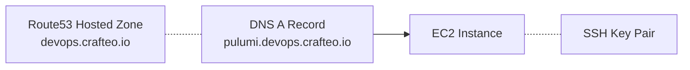

# Pulumi demo

Demo comparing a Pulumi stack with CloudFormation equivalent

Demo infrastructure:



Pulumi usage:

```
# Create new project
pulumi new aws-typescript --force

# Create ssh key
ssh-keygen -f ./sshkey

# Up stack
pulumi up -y 

# Access Pulumi website to see stack and backend
# https://app.pulumi.com/


```

CloudFormation usage:

```
aws cloudformation create-stack \
 --stack-name cloudformation-vs-pulumi \
 --template-body file://cloudformation.yml \
 --parameters='[
   {
    "ParameterKey": "HostedZone",
    "ParameterValue": "devops.crafteo.io."
  },
  {
    "ParameterKey": "KeyPair",
    "ParameterValue": "pulumi-vs-cf"
  }
 ]'
```